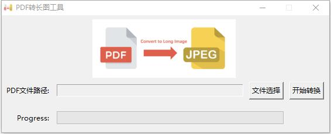
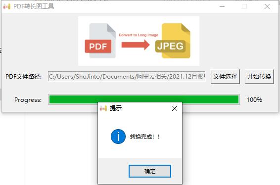

# Convert PDF to Long Image(JPG)

PDF转换成长图工具（JPG/JPEG）

最近在进行报销的时候财务要求将PDF格式的消费账单以图片格式上传，本来很简单的事情。但整个PDF文件有3页，所以常规的屏幕截图工具（QQ的`Ctrl+Alt+A`）已经无法满足，为了达到将整个pdf转换成图片的目的在网上搜索一番之后发现已经有人用`Python`实现，只不过是命令行的。为了使用方便这里用`tkinter`封装了一下，特分享出来

forked from [Convert PDF to Long Image(JPG)](https://github.com/whitelok/pdf-to-long-image), source project is a
command-line tool. I modified to gui, it look like below:



### How to use

##### **Needed Python 3.9+**

1. `git clone https://github.com/shojinto/pdf-to-long-image.git`
2. `cd pdf-to-long-image`
3. `pip install -r requirements.txt`
4. `python convert.py `



#### **build to exe**

1. `pip install pyinstaller`
2. generate `spec` file and modify it.

```shell
> cd pdf-to-long-image
> pyinstaller -w -F -i pdf-to-image.ico
> ls .
...
> 2022/01/14  17:39             1,115 convert.spec # tkinter编写的gui程序通过pyinstaller打包后的exe运行
                                                 # 会发生自定义的icon和背景图片等资源not found，因此需要对内容进行修改
...
> cat convert.spec
...
a = Analysis(['convert.py'],
             pathex=[],
             binaries=[],
             datas=[("pdf-to-image.ico","."),("pdf-to-image.gif",".")], # 此处便是修改后的内容，这里的格式为：[(resource_file,resource_path)]
             hiddenimports=[],
             hookspath=[],
...
```

3. modify `converty.py`, Add redundant processing for resource file lookup

   基本原理：Pyinstaller 可以将资源文件一起bundle到exe中，当exe在运行时，会生成一个临时文件夹，程序可通过sys._MEIPASS访问临时文件夹中的资源

   官方说明：https://pythonhosted.org/PyInstaller/spec-files.html#spec-file-operation

```shell
> cat convert.py
...
# 生成exe资源文件目录访问路径
def resource_path(relative_path):
    if getattr(sys, 'frozen', False):
        base_path = sys._MEIPASS # 
    else:
        base_path = os.path.abspath('.')
    return os.path.join(base_path, relative_path)
...
# 设置窗口图标、窗口title、设置背景图 (资源文件查找添加冗余)
try:
    window.iconbitmap('pdf-to-image.ico')
    bg_image = tk.PhotoImage(file='pdf-to-image.gif')
except tk.TclError:
    bg_image = tk.PhotoImage(file=resource_path('pdf-to-image.gif'))
    window.iconbitmap(resource_path('pdf-to-image.ico'))
...
```
4. use `pyinstaller` generate exe file.
```shell
> pyinstaller -w -F -i pdf-to-image.ico convert.spec
...
10023 INFO: Updating resource type 24 name 1 language 0
10026 INFO: Appending PKG archive to EXE
13704 INFO: Building EXE from EXE-00.toc completed successfully.
...
```

#### 异常情况

- **pyinstaller 生成的exe 执行报错： `no module named xxx`**

如果通过上面的步骤之后运行编译好的exe文件报错`no module named xxx`,这是因为`pyinstaller`无法自动遍历到项目中的依赖模块，需要使用 `-p` 指定模块所在的位置。例如：

```shell
> pyinstall -w -F -i pdf-to-image.ico -p venv\Lib\site-packages covert.py 
...
10023 INFO: Updating resource type 24 name 1 language 0
10026 INFO: Appending PKG archive to EXE
13704 INFO: Building EXE from EXE-00.toc completed successfully.
...
```
打开生成的`.spec`文件与之前的进行对比发现差异在
- old
```shell
> cat convert.spec
...
a = Analysis(['convert.py'],
             pathex=[],
             binaries=[],
             datas=[("pdf-to-image.ico","."),("pdf-to-image.gif",".")], # 此处便是修改后的内容，这里的格式为：[(resource_file,resource_path)]
             hiddenimports=[],
             hookspath=[],
...
```
- new
```shell
> cat convert.spec
...
a = Analysis(['convert.py'],
             pathex=['venv\\Lib\\site-packages'],
             binaries=[],
             datas=[("pdf-to-image.ico","."),("pdf-to-image.gif",".")], # 此处便是修改后的内容，这里的格式为：[(resource_file,resource_path)]
             hiddenimports=[],
             hookspath=[],
...
```